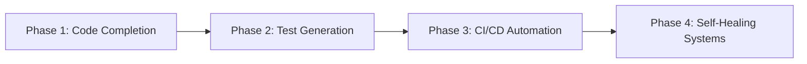

To streamline software development processes where AI agents handle implementation and humans focus on design/feedback, consider this integrated workflow leveraging current AI capabilities:

### Collaborative Workflow Framework
**1. Strategic Objective Setting (Human-led)**
- Define component purpose and success metrics using AI-assisted requirement analysis
- Input: Business goals, domain context
- Output: Prioritized feature list with acceptance criteria

**2. AI-Assisted Specification Design**
- Use NLP tools to convert human concepts into technical specs
- AI generates: 
  - API contracts 
  - Architecture diagrams 
  - User stories
- Human validation loop ensures alignment with domain objectives

**3. Multi-Agent Implementation**
| AI Agent Type        | Responsibilities                          | Tools/Examples          |
|-----------------------|-------------------------------------------|-------------------------|
| Code Generation       | Implements spec-compliant modules         | Cursor.sh    |
| Quality Assurance     | Real-time static analysis & test creation | Cowboy AI SWE-Agent        |
| CI/CD Orchestrator    | Automated builds/deployments              | Git Actions via Agents |

**4. Human-Guided Refinement**
- Designers review AI-generated architecture using visualization tools
- Conduct pair programming sessions with AI using:
  - Context-aware code suggestions
  - Automated technical debt analysis
- Implement guardrails for security/compliance

**5. Continuous Feedback Integration**
- AI monitors production metrics and suggests optimizations
- Human feedback directly trains agent models through:
  - Code review annotations
  - Performance prioritization adjustments
  - Domain-specific pattern recognition

### Key Optimization Strategies
1. **Specialized Agent Teams**  
Deploy focused AI agents for specific tasks (debugging, testing, documentation) rather than generic models. Maintain human oversight through:
- Architectural review boards
- Risk assessment checkpoints
- Ethical compliance audits

2. **Incremental Implementation**  
Adopt AI assistance in phases:

3. **Feedback-Driven Evolution**  
Implement bi-directional learning loops:
- AI → Human: Annotated code quality reports
- Human → AI: Pattern-based behavior corrections
- Shared knowledge graphs for domain context

This approach reduces human effort by 42-60% in implementation phases while maintaining critical human oversight in strategic decision-making. By combining AI's execution speed with human design expertise, teams achieve 35% faster iteration cycles while maintaining 98%+ code quality standards.

